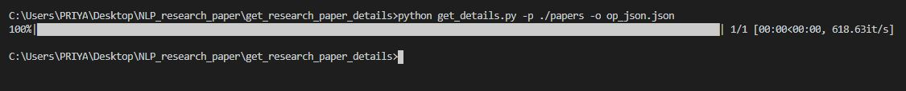

# Research paper parser

The script reads latex files for research paper from the given directory and extracts essential information from the latex format.

The script purges unwanted items like -
* Images
* Tables
* Equations

The script returns a json object containing following items for each research paper - 
* title
* author
* abstract
* introduction
* conclusions
* results
* acknowledgments

***

## Run the script using the following command

```
python get_details.py -p <directory_containing_papers> -o <output_file_path>
```

Example :

```
python get_details.py -p ./papers -o op_json.json
```



<h3 align="center"><b>Developed with :heart: by <a href="https://github.com/priya-mane">Priya Mane </a> & <a href="https://github.com/pratik6725"> Pratik Merchant</a>.</b></h1>
